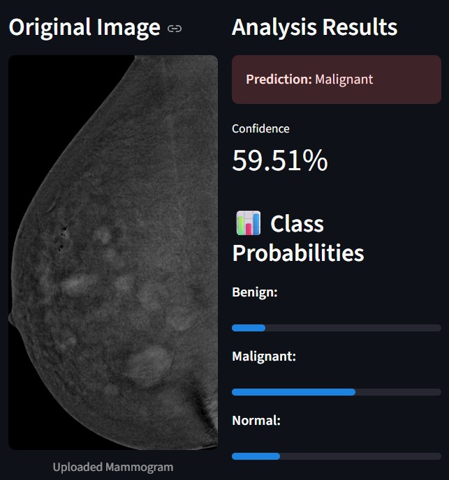
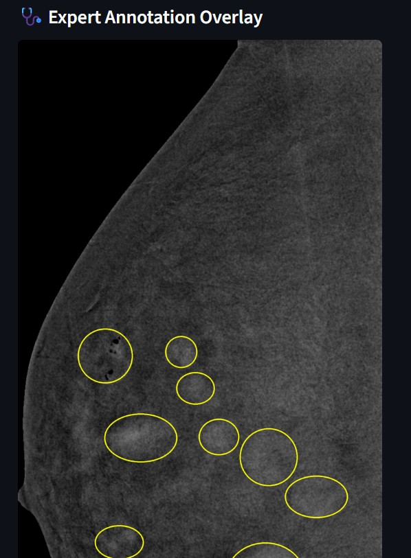
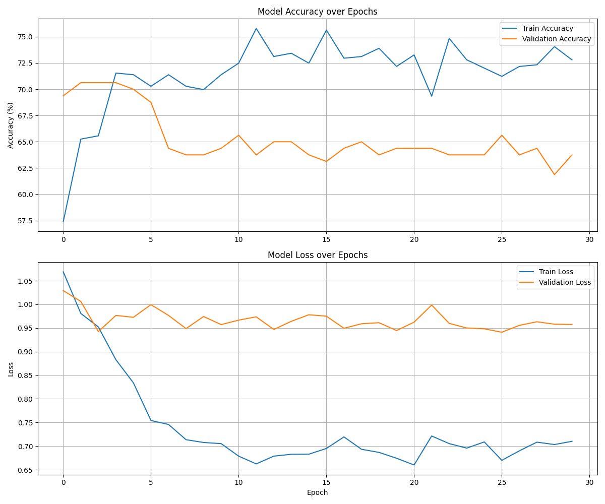
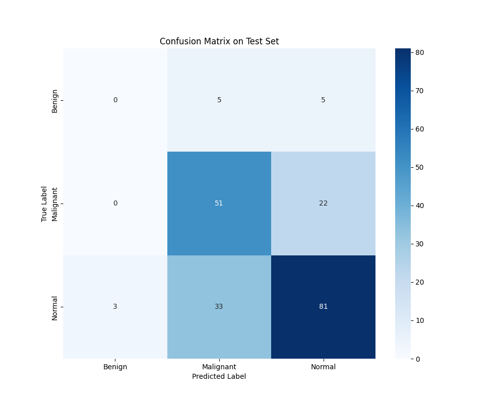

# Breast Cancer Detection Assistant

[](https://www.python.org/downloads/)
[](https://pytorch.org/)
[](https://streamlit.io/)
[](https://opensource.org/licenses/MIT)

An advanced machine learning web application for breast cancer detection using mammogram images. This project leverages a fine-tuned **PyTorch** model based on the **EfficientNet-B0** architecture to classify mammogram images into three distinct categories: **Normal, Benign, and Malignant**.

The application features an intuitive user interface built with Streamlit, providing not only predictions but also visual explanations to aid in understanding the model's decision-making process.

The primary dataset for this project was sourced from The Cancer Imaging Archive (TCIA):
- **Dataset:** [CDD-CESM: Curated Breast Imaging Subset of DDSM](https://www.cancerimagingarchive.net/collection/cdd-cesm/)

---

## Application Preview




---

## Key Features

- **State-of-the-Art Deep Learning Model**: A fine-tuned EfficientNet-B0 model for 3-class classification (Normal, Benign, Malignant).
- **Interactive Web Interface**: A user-friendly and intuitive web application built with Streamlit for easy image upload and analysis.
- **Expert Annotation Overlay**: Automatically draws the ground-truth segmentation masks (lesion boundaries) on the uploaded mammogram, based on the dataset's expert annotations.
- **Detailed Analysis**: Provides a clear prediction, a confidence score, and a breakdown of probabilities for each class.

---

## Project Evolution & Methodology

This project was developed iteratively, with each version improving upon the last to address specific challenges.

### Version 1: Initial Binary Classification
- **Goal**: Differentiate between `Benign` and `Malignant` cases.
- **Challenge**: The initial model showed a high number of **False Negatives**, incorrectly classifying malignant tumors as benign—the most critical error in a medical context.

### Version 2: 3-Class Classification & Weighted Loss
- **Goal**: Introduce a `Normal` class for more granular diagnosis and reduce False Negatives.
- **Improvements**:
    - **3-Class Model**: BI-RADS scores were mapped to `Normal`, `Benign`, and `Malignant`.
    - **Weighted Loss Function**: To combat class imbalance, a weighted loss function was introduced to heavily penalize misclassifications of the minority `Malignant` class.
- **Outcome**: Successfully reduced False Negatives for the `Malignant` class but struggled to accurately identify the rare `Benign` class.

### Version 3: Fine-Tuning & Advanced Techniques (Current Version)
- **Goal**: Improve overall model generalization, reduce overfitting, and enhance the distinction between all classes.
- **Improvements**:
    - **Fine-Tuning**: Unfroze the final convolutional blocks of EfficientNet-B0 to allow the model to learn more specific features from the mammogram data.
    - **Aggressive Data Augmentation**: Introduced more varied image transformations (e.g., color jitter) to create a more robust training set.
    - **Learning Rate Scheduling**: Implemented `ReduceLROnPlateau` to automatically adjust the learning rate, helping the model converge more effectively.
- **Outcome**: This version achieved the best balance, significantly reducing overfitting and almost eliminating the critical error of classifying malignant cases as benign, resulting in the safest and most reliable model.

---

## Final Model Performance

The final model demonstrates a strong ability to distinguish Normal and Malignant cases, which is crucial for a clinical support tool.

#### Training & Validation Curves
The learning curves show a healthy training process with well-controlled overfitting.


#### Confusion Matrix on Test Set
The confusion matrix highlights the model's excellent performance in identifying `Normal` and `Malignant` cases, and its caution in avoiding dangerous misclassifications.


---

## Project Structure


/
|-- assets/
|   |-- training_history_v3.png
|   |-- confusion_matrix_v3.png
|   |-- app_screenshot1.jpg
|   |-- app_screenshot2.jpg
|
|-- dataset/
|   |-- images/
|   |-- final_dataset.csv
|   |-- Radiology_hand_drawn_segmentations.csv
|
|-- app.py
|-- train_model.py
|-- inference.py
|-- requirements.txt
|-- best_model_v3.pth
|-- breast_cancer_model_v3.pth
|-- LICENSE
|-- README.md


---

## Installation & Usage

### Prerequisites
- Python 3.8+
- pip

### Setup
1.  **Clone the repository**
    ```bash
    git clone [https://github.com/alborzbm/Breast-Cancer-Detection-Assistant.git](https://github.com/alborzbm/Breast-Cancer-Detection-Assistant.git)
    cd Breast-Cancer-Detection-Assistant
    ```
2.  **Install dependencies**
    ```bash
    pip install -r requirements.txt
    ```

### Usage
1.  **Train the Model**
    Run the training script to generate the model file (`breast_cancer_model_v3.pth`).
    ```bash
    python train_model.py
    ```
2.  **Run the Web Application**
    Once the model is trained, launch the Streamlit app.
    ```bash
    streamlit run app.py
    ```
    Or, if the `streamlit` command is not in your PATH:
    ```bash
    python -m streamlit run app.py
    ```

---

## Acknowledgments

- This project was made possible by the public dataset provided by **The Cancer Imaging Archive (TCIA)**.
- Special thanks to the creators of PyTorch and Streamlit for their powerful open-source tools.
